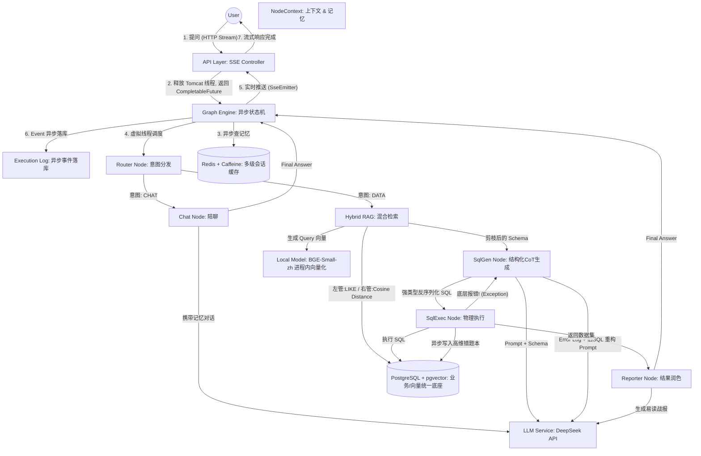

# Nexus-Analyst-Core
企业级 Agentic Workflow 智能数据分析引擎底座


# 👑 Nexus-Analyst: 企业级 Text-to-SQL 智能体高并发引擎


> **Nexus-Analyst** 并非调用大模型 API 的玩具脚本，而是一个旨在解决 **“LLM 高延迟引发的 Web 容器雪崩”、“海量 Schema 注入导致的 Token 溢出”以及“自然语言转 SQL 幻觉”** 的工业级 Agent 底座。

## 🗺️ 系统架构图 (Architecture)

*(注：系统采用全链路异步非阻塞架构，底层基于 DAG 状态机流转)*

 
<!-- ⚠️ 国王注意：把你的图片命名为 architecture.png 放在 docs 文件夹里，或者直接把图片拖进 GitHub 的编辑框，它会自动生成链接替换这行！ -->

## 🚀 核心核武特性 (Core Features)

### 1. 🛡️ 极高并发底座：全链路异步与虚拟线程隔离
- **SSE 流式脱壳**：接入层采用 Server-Sent Events (SSE)，主线程接收请求后瞬间返回 `CompletableFuture`，实现 Tomcat 工作线程的 0 阻塞释放。
- **Virtual Threads 承载**：针对大模型长达数秒的 I/O 阻塞调用，底层强制切入 JDK 21 虚拟线程池 (`businessExecutor`)，利用遇阻塞即卸载的物理特性，在极低内存开销下扛住海量并发挂起。

### 2. 🧠 高维语义降维：Hybrid RAG 与动态剪枝
- **In-process Embedding**：摒弃高延迟的网络大模型，在 JVM 进程内直连 `BGE-Small-zh-v1.5` 本地轻量级神经网络模型，实现零网络开销的自然语言 512 维向量化。
- **双管混合检索 (Hybrid Search)**：左路使用 SQL `LIKE` 稀疏检索保专有名词绝对命中；右路基于 `pgvector` 计算余弦距离进行稠密检索。动态剪枝 Top-3 Schema，削减 90% 的 Token 消耗并扼杀 LLM 注意力涣散幻觉。

### 3. ⚡ 意图级缓存：Semantic Cache 物理拦截
- **高维错题本**：首创基于 `pgvector` 的语义缓存层。将余弦相似度阈值精调至 `< 0.15`，精准拦截同义异构的查询意图。
- **降本增效**：将大模型动辄 5 秒的生成耗时，物理折叠为 100 毫秒内的本地向量数据库查询，彻底防范底层 API 限流风暴。

### 4. 🔗 绝对可控：Structured CoT 与 ReAct 动态自愈
- **强约束反序列化**：通过严苛的 Prompt 强制 LLM 输出包含 `thoughtProcess` 和 `safe` 安全探针的 JSON 结构，在 Java 端实施强类型校验与内存级危险指令熔断。
- **状态机回滚**：底层 JDBC 执行异常不会导致系统崩溃，而是通过控制流反转触发 **ReAct (Reasoning and Acting)** 自愈回路，携带底层 Error Log 驱动大模型进行自我反思与纠错，将最终执行成功率提升至 95% 以上。

## 🛠️ 核心技术栈 (Tech Stack)

- **核心框架**: Java 21, Spring Boot 3.2, CompletableFuture (异步编排)
- **AI 生态**: LangChain4j, BGE-Small-zh-v1.5 (本地 ONNX 运行)
- **存储与向量**: PostgreSQL 16, pgvector 扩展
- **高并发缓存**: Caffeine (L1 纳秒级本地缓存) + Redis (L2 毫秒级分布式会话)
- **交互与解耦**: Server-Sent Events (SSE), Spring Event (旁路日志解耦)

## ⚙️ 快速启动 (Quick Start)

### 1. 环境准备
```bash
# 启动带有 pgvector 扩展的 PostgreSQL
docker run -d --name nexus-pgvector -e POSTGRES_USER=postgres -e POSTGRES_PASSWORD=root -e POSTGRES_DB=nexus_db -p 5432:5432 pgvector/pgvector:pg16

# 启动 Redis 会话缓存
docker run -d --name nexus-redis -p 6379:6379 redis:latest


