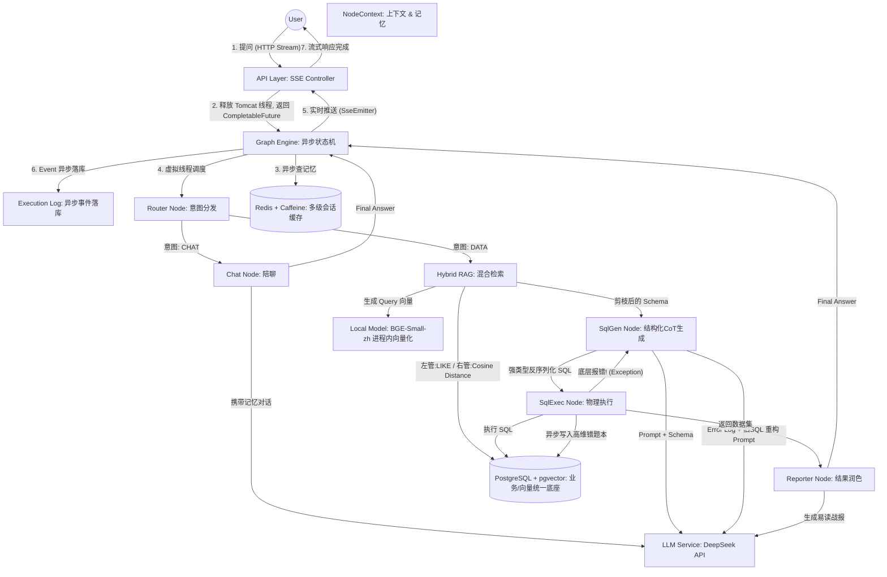

# Nexus-Analyst-Core
企业级 Agentic Workflow 智能数据分析引擎底座

```mermaid
graph TD
    %% --- 用户入口 ---
    User((User))
    API[API Layer: SSE Controller]
    
    %% --- 核心引擎 (JDK 21 Virtual Threads) ---
    Engine[Graph Engine: 异步状态机]
    Context[NodeContext: 上下文 & 记忆]
    Log[Execution Log: 异步事件落库]
    
    %% --- 业务节点 ---
    Router[Router Node: 意图分发]
    Chat[Chat Node: 陪聊]
    
    %% --- 数据分析核心链路 ---
    Retriever[Hybrid RAG: 混合检索]
    SqlGen[SqlGen Node: 结构化CoT生成]
    SqlExec[SqlExec Node: 物理执行]
    Reporter[Reporter Node: 结果润色]
    
    %% --- 基础设施 (高维统一底座) ---
    PG[(PostgreSQL + pgvector: 业务/向量统一底座)]
    Redis[(Redis + Caffeine: 多级会话缓存)]
    LLM[LLM Service: DeepSeek API]
    LocalEM[Local Model: BGE-Small-zh 进程内向量化]
    
    %% --- 连线逻辑 ---
    User -- "1. 提问 (HTTP Stream)" --> API
    API -- "2. 释放 Tomcat 线程, 返回 CompletableFuture" --> Engine
    
    Engine -- "3. 异步查记忆" --> Redis
    Engine -- "4. 虚拟线程调度" --> Router
    
    Router -- "意图: CHAT" --> Chat
    Chat -- "携带记忆对话" --> LLM
    
    Router -- "意图: DATA" --> Retriever
    Retriever -- "生成 Query 向量" --> LocalEM
    Retriever -- "左管:LIKE / 右管:Cosine Distance" --> PG
    Retriever -- "剪枝后的 Schema" --> SqlGen
    
    SqlGen -- "Prompt + Schema" --> LLM
    SqlGen -- "强类型反序列化 SQL" --> SqlExec
    
    SqlExec -- "执行 SQL" --> PG
    
    %% --- ReAct 自愈闭环 ---
    SqlExec -- "底层报错! (Exception)" --> SqlGen
    SqlGen -- "Error Log + 旧SQL 重构 Prompt" --> LLM
    
    %% --- 成功链路 ---
    SqlExec -- "异步写入高维错题本" --> PG
    SqlExec -- "返回数据集" --> Reporter
    Reporter -- "生成易读战报" --> LLM
    
    %% --- 最终输出 ---
    Reporter -- "Final Answer" --> Engine
    Chat -- "Final Answer" --> Engine
    
    Engine -- "5. 实时推送 (SseEmitter)" --> API
    Engine -- "6. Event 异步落库" --> Log
    API -- "7. 流式响应完成" --> User
```

